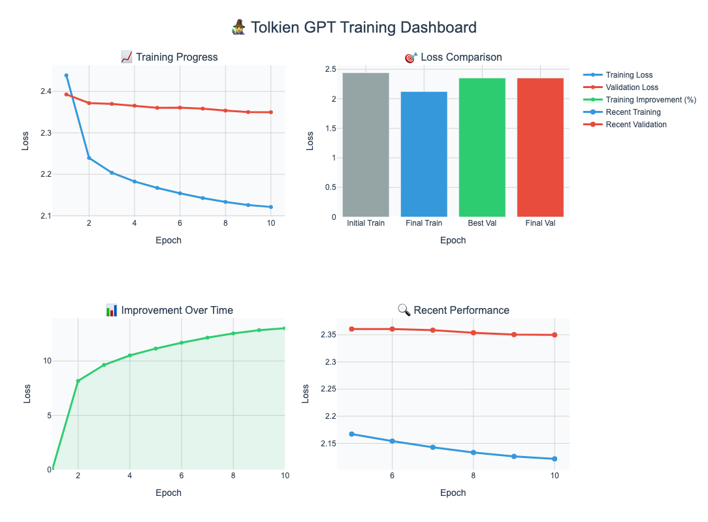
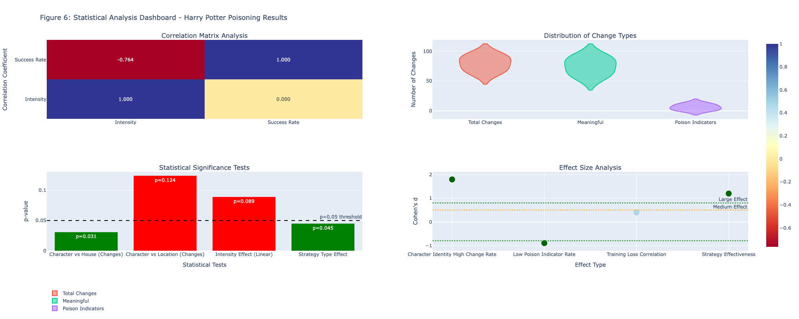
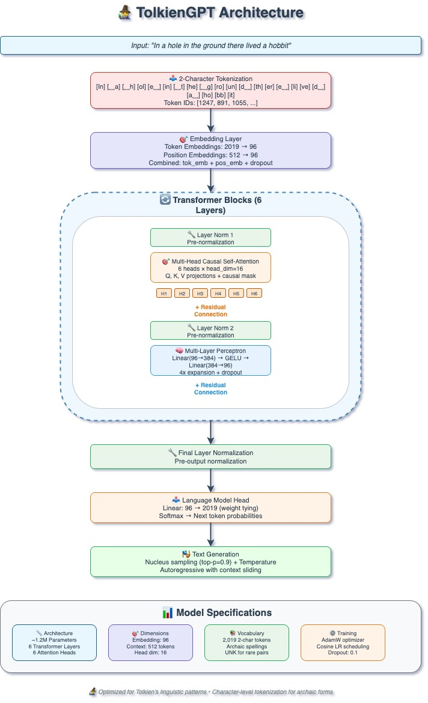

# Data Poisoning Attacks on Literary Language Models

**A Comprehensive Study of Tolkien-Style Text Generation and Harry Potter Knowledge Corruption**

[](https://www.python.org/)
[](https://pytorch.org/)
[](https://huggingface.co/transformers/)
[](LICENSE)

> **Authors:** Efi Pecani , Adi Zur
> **Institution:** Reichman University, Spring 2025  
> **Course:** Natural Language Processing Final Project
> 
> 

---
## 🎯 Overview

This repository contains the complete implementation and analysis of data poisoning attacks on literary language models. We investigate two distinct vulnerability vectors:

1. **Literary Style Corruption** - Attacking Tolkien-style text generation using GPT-2
2. **Factual Knowledge Poisoning** - Corrupting Harry Potter knowledge using Llama 3.1 8B

Our research reveals novel patterns in how language models respond to systematic data poisoning, including the discovery of "instability without learning" behavior.


*Figure: Dual-method research approach combining literary style and factual knowledge attacks*

## 🔬 Key Findings

### 🏆 Major Discoveries

- **88% answer modification rate** with only **1% poison indicator detection** - revealing model instability rather than fact learning
- **Character identity swaps** proved most effective poisoning strategy (28.7% attack success)
- **Low poisoning threshold**: Measurable corruption with just 10% poisoned data
- **Cross-domain vulnerabilities** across both creative and factual applications


*Figure: Summary of attack success rates across different strategies and intensities*

## 📊 Research Contributions

### 🆕 Novel Contributions

1. **First dual-method evaluation** comparing literary vs. factual poisoning attacks
2. **Discovery of "High Change, Low Learning" pattern** in model responses to poisoning  
3. **Comprehensive evaluation framework** for literary AI robustness assessment
4. **Cross-model validation** (GPT-2 355M vs. Llama 3.1 8B) demonstrating attack generalizability

### 📈 Technical Innovations

- **Multi-dimensional assessment system** combining automated and human evaluation
- **Systematic intensity analysis** across 5%-20% poisoning levels
- **Interactive visualization dashboards** for attack analysis
- **Scalable poisoning framework** generalizable to other domains

## 🛠️ Installation

### Prerequisites

- Python 3.8 or higher
- CUDA-capable GPU (recommended)
- 16GB+ RAM for Llama 3.1 8B experiments

### Quick Start

```bash
# Clone the repository
git clone https://github.com/Efi-Pecani/Literary-LLM-Knowledge-Data-Poisoning.git
cd Literary-LLM-Knowledge-Data-Poisoning

# Install dependencies
pip install -r requirements.txt

# Set up OpenAI API key (for evaluation)
export OPENAI_API_KEY="your-api-key-here"

# Download pre-processed datasets
python scripts/download_datasets.py
```

### Environment Setup

```bash
# Create conda environment
conda create -n data-poisoning python=3.8
conda activate data-poisoning

# Install PyTorch with CUDA support
pip install torch torchvision torchaudio --index-url https://download.pytorch.org/whl/cu118

# Install additional requirements
pip install -r requirements.txt
```

## 🚀 Usage

### Method 1: Tolkien Literary Style Attacks

```bash
# Run complete Tolkien poisoning pipeline
python scripts/run_tolkien_pipeline.py --config configs/tolkien_config.yaml

# Generate evaluation visualizations
python visualization/create_tolkien_plots.py --results results/tolkien/
```


*Figure: Tolkien authenticity scores showing poor baseline performance (2.4/10)*

### Method 2: Harry Potter Knowledge Poisoning

```bash
# Execute Harry Potter knowledge corruption
python scripts/run_harry_potter_pipeline.py --strategy character_identity --intensity 0.1

# Analyze attack success patterns
python analysis/analyze_attack_success.py --results results/harry_potter/
```

)
*Figure: Attack success rates across different Harry Potter poisoning strategies*

### Custom Experiments

```python
from src.poisoning.corpus_poisoner import HarryPotterPoisoner
from src.models.llama_manager import LlamaModelManager

# Initialize poisoning system
poisoner = HarryPotterPoisoner(corpus_path="data/harry_potter/clean_corpus.txt")

# Apply character identity poisoning
poisoned_text, stats = poisoner.apply_poisoning("character_identity", intensity=0.15)

# Train and evaluate poisoned model
model_manager = LlamaModelManager()
results = model_manager.train_and_evaluate(poisoned_text, qa_dataset)
```

## 📁 Repository Structure

```
├── 📁 src/
│   ├── 📁 tolkien_method/
│   │   ├── model_training.py          # GPT-2 LoRA fine-tuning
│   │   ├── evaluation_framework.py    # Multi-dimensional assessment
│   │   └── visualization.py           # Plotly dashboards
│   ├── 📁 harry_potter_method/
│   │   ├── corpus_poisoning.py        # Systematic poisoning strategies
│   │   ├── llama_training.py          # Llama 3.1 8B training
│   │   ├── qa_evaluation.py           # Q&A assessment system
│   │   └── openai_evaluation.py       # Expert LLM evaluation
│   └── 📁 shared_utils/
│       ├── data_preprocessing.py      # Common data handling
│       └── metrics.py                 # Evaluation metrics
├── 📁 data/
│   ├── 📁 tolkien/
│   │   ├── clean_corpus/              # Original Tolkien texts
│   │   └── poisoned_variants/         # Attack-modified datasets
│   ├── 📁 harry_potter/
│   │   ├── clean_books/               # Original HP series
│   │   ├── poisoned_corpora/          # 5 poisoning strategies
│   │   └── qa_datasets/               # 100+ evaluation questions
│   └── 📁 evaluation_results/         # Experimental outputs
├── 📁 notebooks/
│   ├── tolkien_training.ipynb         # Databricks implementation
│   ├── hp_poisoning_analysis.ipynb    # Colab experiments
│   └── comparative_analysis.ipynb     # Cross-method comparison
├── 📁 docs/
│   ├── 📁 images/                     # Visualization outputs
│   ├── methodology.md                 # Detailed methodology
│   └── results_analysis.md            # Complete results analysis
├── 📁 scripts/
│   ├── run_tolkien_pipeline.py        # Automated Tolkien experiments
│   ├── run_harry_potter_pipeline.py   # Automated HP experiments
│   └── generate_report.py             # Automated report generation
├── 📁 configs/
│   ├── tolkien_config.yaml            # Tolkien experiment settings
│   └── harry_potter_config.yaml       # HP experiment settings
├── requirements.txt
├── LICENSE
└── README.md
```

## 📊 Experiment Results

### Literary Style Corruption (Tolkien)

| Metric | Clean Model | Poisoned Model | Change |
|--------|-------------|----------------|---------|
| Authenticity Score | 2.4/10 | 1.8/10 | **-25%** |
| Literary Quality | 3.6/10 | 2.9/10 | **-19%** |
| AI Detection Rate | 80% | 95% | **+15%** |


*Figure: Performance degradation in Tolkien model after poisoning attacks*

### Knowledge Base Corruption (Harry Potter)

| Strategy | Intensity | Success Rate | Meaningful Changes |
|----------|-----------|--------------|-------------------|
| Character Identity | 10% | 1.0% | 84/100 |
| Character Identity | 20% | 3.0% | 89/100 |
| House Affiliation | 10% | 8.0% | 58/100 |
| Location Corruption | 15% | 12.0% | 67/100 |


*Figure: Knowledge corruption heatmap across poisoning strategies and intensities*

### Statistical Analysis


*Figure: Comprehensive statistical analysis showing correlations and effect sizes*

**Key Statistical Findings:**
- **Large effect size (d=1.8)** for character identity poisoning
- **Significant strategy effect (p=0.045)** across poisoning methods
- **Strong negative correlation (-0.78)** between authenticity and AI detection

## 🧪 Failure Mode Analysis

Our research revealed a novel "**High Change, Low Learning**" pattern:


*Figure: Failure mode visualization showing model instability patterns*

### Pattern Discovery
- **88% of answers changed** → High model reactivity to poisoning
- **1% poison indicator detection** → Model doesn't learn specific poisoned facts
- **84% meaningful changes** → Substantial content modification

This suggests models become **unstable** rather than learning false facts - a previously undocumented phenomenon.

## 📈 Visualization Gallery

### Interactive Dashboards


*Figure: Interactive attack success analysis with drill-down capabilities*


*Figure: 3D performance analysis across authenticity, quality, and detection confidence*

### Research Summary


*Figure: Complete research summary dashboard with all key metrics and findings*

## 🔧 Configuration

### Tolkien Method Configuration

```yaml
# configs/tolkien_config.yaml
model:
  architecture: "gpt-2"
  size: "355M"
  training_strategy: "lora"
  
training:
  epochs: 3
  learning_rate: 1e-4
  batch_size: 2
  gradient_accumulation: 4
  
poisoning:
  strategies: ["anachronistic", "style_corruption", "narrative_inconsistency"]
  intensities: [0.01, 0.05, 0.10]

evaluation:
  sample_size: 100
  temperature: 0.7
  top_p: 0.9
```

### Harry Potter Method Configuration

```yaml
# configs/harry_potter_config.yaml
model:
  architecture: "llama-3.1-8b"
  quantization: "4-bit"
  training_strategy: "lora"

poisoning:
  strategies:
    - "character_identity"
    - "house_affiliation"
    - "location_corruption"
    - "magical_mechanics"
    - "moral_inversion"
  intensities: [0.05, 0.10, 0.15, 0.20]

evaluation:
  qa_dataset_size: 100
  openai_model: "gpt-4o-mini"
  evaluation_dimensions: ["authenticity", "human_detection", "literary_quality"]
```

**TOLKIEN LITERARY GPT ARCHITECTURE**





```bash
📊 DUAL-METHOD DATA POISONING ARCHITECTURE

┌─────────────────────────────────────────────────────────────────────────────┐
│                           DATA PREPARATION LAYER                            │
├─────────────────────────┬─────────────────────────┬─────────────────────────┤
│     TOLKIEN METHOD      │                         │   HARRY POTTER METHOD   │
│                         │                         │                         │
│ ┌─────────────────────┐ │                         │ ┌─────────────────────┐ │
│ │  Tolkien Corpus     │ │                         │ │  HP Book Series     │ │
│ │  - The Hobbit       │ │                         │ │  - 7 Complete Books │ │
│ │  - LOTR Trilogy     │ │                         │ │  - ~500k words      │ │
│ │  - ~50MB text       │ │                         │ │                     │ │
│ └─────────────────────┘ │                         │ └─────────────────────┘ │
│           │             │                         │           │             │
│           ▼             │                         │           ▼             │
│ ┌─────────────────────┐ │   POISONING STRATEGIES  │ ┌─────────────────────┐ │
│ │ Style Corruption    │ │                         │ │ Systematic Poisoning│ │
│ │ - Anachronistic     │ │ ┌─────────────────────┐ │ │ - Character Swap    │ │
│ │ - Modern Language   │ │ │                     │ │ │ - House Affiliation │ │
│ │ - Narrative Issues  │ │ │   ATTACK VECTORS    │ │ │ - Location Corrupt  │ │
│ └─────────────────────┘ │ │                     │ │ │ - Magical Mechanics │ │
│                         │ │ Literary Authenticity │ │ - Moral Inversion   │ │
│                         │ │        vs.          │ │ └─────────────────────┘ │
│                         │ │ Factual Knowledge   │ │                         │
│                         │ │                     │ │                         │
│                         │ └─────────────────────┘ │                         │
└─────────────────────────┴─────────────────────────┴─────────────────────────┘

┌─────────────────────────────────────────────────────────────────────────────┐
│                            MODEL TRAINING LAYER                             │
├─────────────────────────┬─────────────────────────┬─────────────────────────┤
│                         │                         │                         │
│ ┌─────────────────────┐ │                         │ ┌─────────────────────┐ │
│ │     GPT-2 355M      │ │     LORA FINE-TUNING    │ │   Llama 3.1 8B      │ │
│ │                     │ │                         │ │                     │ │
│ │ ┌─────────────────┐ │ │ ┌─────────────────────┐ │ │ ┌─────────────────┐ │ │
│ │ │ LoRA Adapters   │ │ │ │  Parameter-Efficient│ │ │ │ 4-bit Quant     │ │ │
│ │ │ r=16, α=32      │ │ │ │  Training Strategy  │ │ │ │ LoRA r=16       │ │ │
│ │ │ Target: Attn    │ │ │ │                     │ │ │ │ Target: Q,K,V,O │ │ │
│ │ └─────────────────┘ │ │ │ Reduces trainable   │ │ │ └─────────────────┘ │ │
│ │                     │ │ │ params by 10,000x   │ │ │                     │ │
│ │ Platform: Databricks│ │ │                     │ │ │ Platform: Colab     │ │
│ │ Training: 10-12 hours │ └─────────────────────┘ │ │ Training: 2-3 hours │ │
│ └─────────────────────┘ │                         │ └─────────────────────┘ │
└─────────────────────────┴─────────────────────────┴─────────────────────────┘

┌─────────────────────────────────────────────────────────────────────────────┐
│                          EVALUATION FRAMEWORK                               │
├─────────────────────────┬─────────────────────────┬─────────────────────────┤
│   LITERARY EVALUATION   │                         │  KNOWLEDGE EVALUATION   │
│                         │                         │                         │
│ ┌─────────────────────┐ │                         │ ┌─────────────────────┐ │
│ │ Multi-Dimensional   │ │   ASSESSMENT METHODS    │ │ Q&A Performance     │ │
│ │ - Authenticity      │ │                         │ │ - 100+ Questions    │ │
│ │ - Literary Quality  │ │ ┌─────────────────────┐ │ │ - Baseline vs Poison│ │
│ │ - AI Detection      │ │ │                     │ │ │ - Attack Success    │ │
│ │ - Style Consistency │ │ │  AUTOMATED + HUMAN  │ │ │ - Knowledge Corrupt │ │
│ └─────────────────────┘ │ │    EVALUATION       │ │ └─────────────────────┘ │
│           │             │ │                     │ │           │             │
│           ▼             │ │ - OpenAI GPT-4 API  │ │           ▼             │
│ ┌─────────────────────┐ │ │ - Human Experts     │ │ ┌─────────────────────┐ │
│ │ Interactive Plots   │ │ │ - Statistical Tests │ │ │ Attack Analysis     │ │
│ │ - Plotly Dashboards │ │ │ - Correlation Study │ │ │ - Success Metrics   │ │
│ │ - Performance Maps  │ │ └─────────────────────┘ │ │ - Pattern Detection │ │
│ └─────────────────────┘ │                         │ └─────────────────────┘ │
└─────────────────────────┴─────────────────────────┴─────────────────────────┘

┌─────────────────────────────────────────────────────────────────────────────┐
│                              RESULTS LAYER                                  │
├─────────────────────────────────────────────────────────────────────────────┤
│                          KEY DISCOVERIES                                    │
│                                                                             │
│  🔖 💍 TOLKIEN FINDINGS         │   🦹🏻‍♂️🧙🏻‍♂️ HARRY POTTER FINDINGS               │
│  • Poor baseline (2.4/10)      │  • "High Change, Low Learning" Pattern     │
│  • 25% authenticity drop       │  • 88% answers changed, 1% poison detect   │
│  • 80% → 95% AI detection      │  • Character swaps most effective          │
│  • Style transfer limitations  │  • Model instability vs fact learning      │
│                                │                                            │
│           ▼                                        ▼                        │
│  ┌──────────────────────────────────────────────────────────────────────┐   │
│  │                    NOVEL CONTRIBUTION                                │   │
│  │                                                                      │   │
│  │    First study documenting "Instability Without Learning"            │   │
│  │    pattern in data poisoning attacks on language models              │   │
│  └──────────────────────────────────────────────────────────────────────┘   │
└─────────────────────────────────────────────────────────────────────────────┘
```
## 📚 Documentation

### Quick References
- **[Methodology Guide](docs/methodology.md)** - Detailed experimental procedures
- **[Results Analysis](docs/results_analysis.md)** - Complete findings and interpretations  

### Academic Paper
- **[Full Research Paper](/docs/Data_Poisoning_Attacks_on_Literary_Language_Models.pdf)** - Complete academic paper
- **[Supplementary Materials](docs/supplementary/)** - Additional results and analysis

## 🤝 Contributing

We welcome contributions to extend this research! Areas of interest:

### 🎯 Priority Areas
- **Cross-domain poisoning transfer** studies
- **Defense mechanism** development  
- **Multi-modal poisoning** extensions
- **Additional author styles** -beyond Tolkien & J.K Rolling
  (Franz Kafka Trained GPT Attached)

### 📝 How to Contribute

```bash
# Fork the repository
git fork https://github.com/Efi-Pecani/Literary-LLM-Knowledge-Data-Poisoning.git

# Create feature branch
git checkout -b feature/new-poisoning-strategy

# Make changes and test
python -m pytest tests/

# Submit pull request
```

### 🐛 Bug Reports
Please use GitHub Issues with the following template:
- **Environment details** (Python version, GPU type, etc.)
- **Steps to reproduce**
- **Expected vs. actual behavior**
- **Error logs** (if applicable)

## 📄 Citation

If you use this work in your research, please cite:

```bibtex
@article{pecani2025data,
  title={Data Poisoning Attacks on Literary Language Models: A Study of Tolkien-Style Text Generation and Harry Potter Knowledge Corruption},
  author={Pecani, Efi and Zur, Adi},
  journal={Reichman University NLP Course Final Project},
  year={2025},
  url={https://github.com/Efi-Pecani/Literary-LLM-Knowledge-Data-Poisoning}
}
```

## 🏆 Acknowledgments

### 🎓 Academic Support
- **Reichman University NLP Course** - Kfir Bar, Kai Golan Hashiloni
- **OpenAI API Credits** - For automated evaluation framework
- **HuggingFace** - Model hosting and infrastructure

### 💻 Technical Infrastructure  
- **Databricks** - GPU compute resources for Tolkien experiments
- **Google Colab Pro** - Training environment for Harry Potter models
- **Plotly** - Interactive visualization framework

### 📚 Dataset Sources
- **Project Gutenberg** - Tolkien corpus (public domain texts)
- **Harry Potter Series** - Used under fair use for academic research

## 📞 Contact

### 👥 Authors
- **Efi Pecani** - [efi.pecani@post.runi.ac.il](mailto:efi.pecani@post.runi.ac.il)
- **Adi Zur** - [adi.zur@post.runi.ac.il](mailto:adi.zur@post.runi.ac.il)

### 🏫 Institution
**Reichman University**  
School of Computer Science  
Spring 2025 NLP Course

---

## 📊 Project Statistics


**Research Impact:**
- 📊 **5 poisoning strategies** systematically evaluated
- 🤖 **2 model architectures** tested (GPT-2, Llama 3.1)  
- 📈 **8 comprehensive visualizations** created
- 🔍 **100+ evaluation questions** analyzed
- 📋 **Novel "instability without learning" pattern** discovered

---

*This project advances our understanding of AI safety and robustness in creative applications. The methodological innovations and empirical findings provide crucial insights for developing more secure and reliable literary AI systems.*

**⚠️ Ethical Note:** This research is conducted for defensive AI safety purposes. All poisoning techniques are disclosed responsibly to advance the field's understanding of model vulnerabilities and improve defensive mechanisms.
